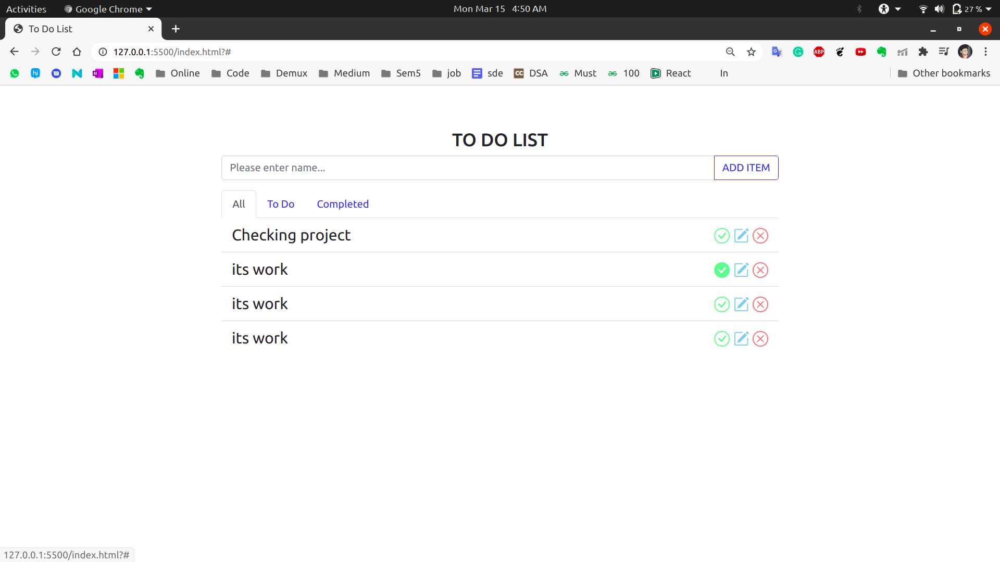
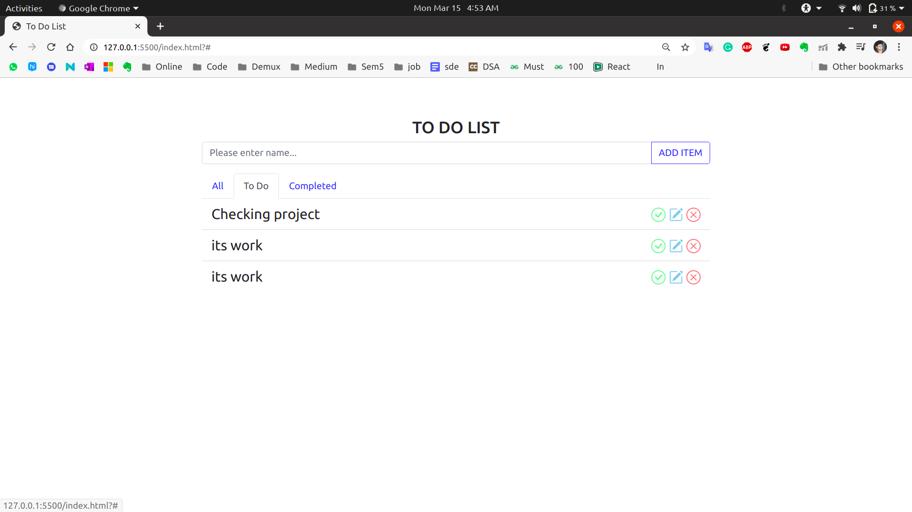
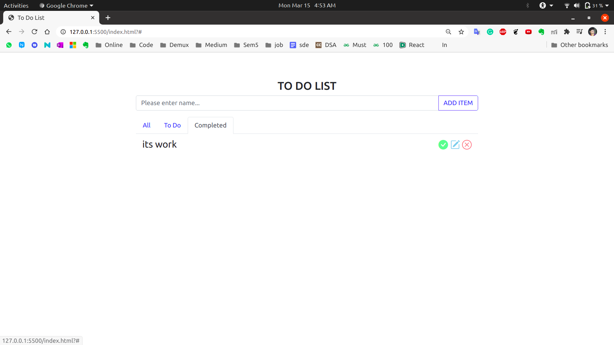

# **TO-DO-LIST** app using pure _javaScript_
---
In the TO DO LIST three sections are created :-
---
* ```All :- All contains list of the works to performs, It mean its contains TODO and COMPLETED both task.```



* ``` TODO :- It contains the remaining works to be performed. ```



* ``` Completed :- It contains the completed task.```



---
Lists contain three buttons :
---
| Complet | Edit | Delet |
| --- | --- | --- |
